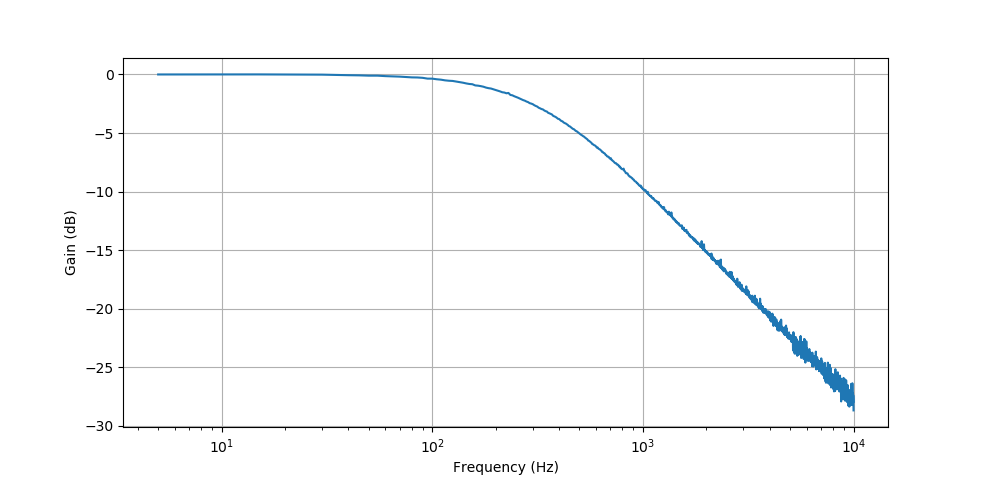
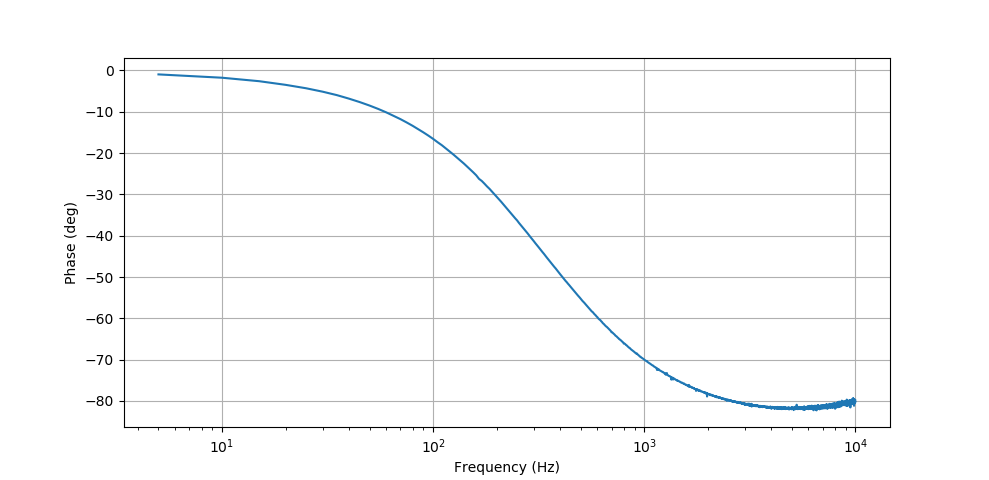

# demo-bode-plotter

GEX demo measuring the amplitude and phase frequency response of analog filtes.

This demo uses an external waveform generador AD9833 (on a breakout module from eBay).
It could also use the built-in DAC, but the performance is sub-optimal and the plots
obtained with it had a lot of glitches. Feel free to adjust the script to use the 
internal DAC and try it.

The AD9833 is connected to SPI on pins PA4 (SS), PA5 (SCK), and PA7 (MOSI). 
Pins PA1 and PA2 are used by the ADC and attach before and after the filter (DUT).

The generator has low output levels (0.65 V max). To better utilize the
input range of the ADC, I used OP213 in a non-inverting configuration 
(resistors 7.5k and 2.2k), with a 10M resistor from the input to GND. This gives us gain
of around 4.4, enough to reach just under 3V.

## To run the script

- Change the 'gex' symlink to point to your copy of the GEX client library.
- Load the attached UNITS.INI file into GEX (intended for GEX Hub)
- Connect the external circuitry and run the script.

Dependencies - pyplot, numpy, and whatever you need to use the GEX library: typically pyusb or pyserial.

## Example outputs

